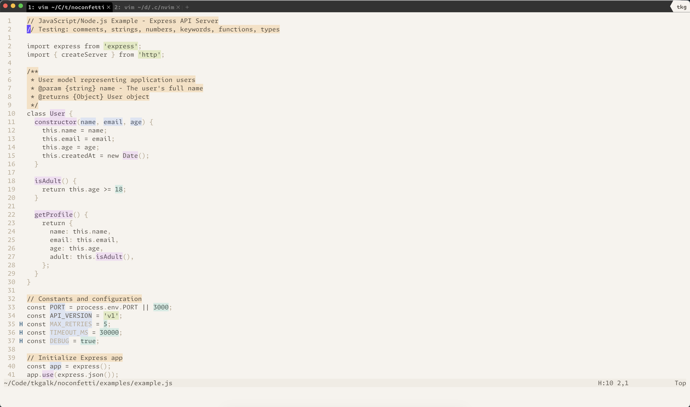
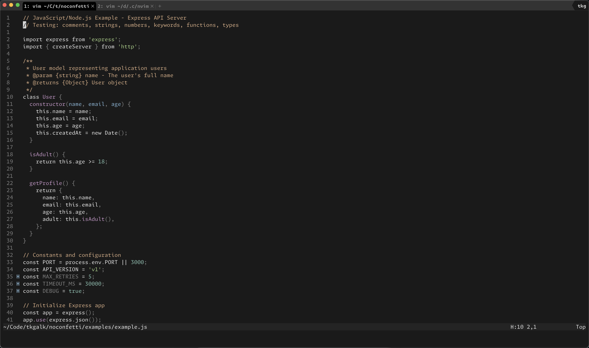

# Noconfetti

A minimal color theme for Neovim and WezTerm, adapted from [flatwhite-syntax](https://github.com/biletskyy/flatwhite-syntax) by biletskyy.

## Philosophy

> "If everything is highlighted, nothing is highlighted."

Noconfetti follows the principles outlined in tonsky's ["Syntax Highlighting"](https://tonsky.me/blog/syntax-highlighting/) article:

- **Minimal colors** - Only 4-5 colors for actual visual lookup
- **Highlight what matters** - Strings, constants, comments, top-level definitions
- **Leave most code neutral** - Keywords, variables, function calls remain unhighlighted
- **Make comments visible** - They contain important information

### What Gets Highlighted

- ✅ Strings and constants
- ✅ Function and method definitions
- ✅ Comments (with background)
- ✅ Variable declarations (in some languages)

### What Stays Neutral

- ❌ Keywords (`if`, `for`, `while`, `def`, `function`, `class`)
- ❌ Variable and function usage
- ❌ Operators
- ❌ Most punctuation

## Installation

### Neovim

Using [lazy.nvim](https://github.com/folke/lazy.nvim):

```lua
{
  'tkgalk/noconfetti',
  lazy = false,
  priority = 1000,
  config = function()
    vim.cmd('colorscheme noconfetti-light')
    -- or vim.cmd('colorscheme noconfetti-dark')
  end,
}
```

Using [mini.deps](https://github.com/echasnovski/mini.deps):

```lua
local add = MiniDeps.add

add('tkgalk/noconfetti')
vim.cmd('colorscheme noconfetti-light')
-- or vim.cmd('colorscheme noconfetti-dark')
```

Using `vim.pack.add()` (Neovim 0.12+):

```lua
-- Add to your init.lua
vim.pack.add('noconfetti')
vim.cmd('colorscheme noconfetti-light')
-- or vim.cmd('colorscheme noconfetti-dark')
```

### WezTerm

Add to your `~/.wezterm.lua`:

```lua
local wezterm = require 'wezterm'

return {
  color_scheme_dirs = { '/path/to/noconfetti/extras/wezterm' },
  color_scheme = 'noconfetti-light',
  -- or
  -- color_scheme = 'noconfetti-dark',
}
```

Or manually copy the TOML files from `extras/wezterm/` to your WezTerm color schemes directory (`colors/` next to your `wezterm.lua`).

## Screenshots

### Light Theme



### Dark Theme



## Supported Languages
I mainly added support (and tested) the languages I personally use, or which I know to be popular and that have easily installable LSPs to test with.

Legend: ✅ Fully supported | ⚠️ Partially supported | ❌ Not supported

- ✅ C
- ✅ CSS
- ✅ HTML
- ✅ JavaScript
- ✅ Lua 
- ✅ Markdown
- ✅ Python
- ✅ Ruby
- ✅ Shell/Bash
- ✅ TOML
- ✅ Terraform/HCL
- ✅ TypeScript
- ✅ YAML
- ⚠️ C#
- ⚠️ C++ (no LSP semantic tokens support; inconsistent)
- ⚠️ Go (no LSP semantic tokens support; odd behaviour)
- ⚠️ Java
- ⚠️ Kotlin
- ⚠️ Rust (no LSP semantic tokens support; inconsistent)

## Supported Plugins
I added support for some plugins I use.

- `oil.nvim`
- `mini.diff`
- `mini.pick`

## Color Palette

### Light Theme

| Color      | Hex       | Usage                    |
|------------|-----------|--------------------------|
| Orange     | `#f7e0c3` | Comments (background)    |
| Green      | `#e2e9c1` | Strings (background)     |
| Teal       | `#d2ebe3` | Constants (background)   |
| Blue       | `#dde4f2` | Identifiers (background) |
| Purple     | `#f1ddf1` | Functions (background)   |

### Dark Theme

Uses foreground-only colors (no backgrounds) for a more subtle appearance.

## Requirements

- Neovim >= 0.9.0
- Terminal with true color support
- Treesitter (recommended for best syntax highlighting)
- LSP (optional, for semantic highlighting)

## Credits

- Inspired by [flatwhite-syntax](https://github.com/biletskyy/flatwhite-syntax) by biletskyy
- Philosophy from [tonsky's article](https://tonsky.me/blog/syntax-highlighting/)
- Also influenced by: [Alabaster](https://git.sr.ht/~p00f/alabaster.nvim), [No Clown Fiesta](https://github.com/aktersnurra/no-clown-fiesta.nvim)

## License

MIT
