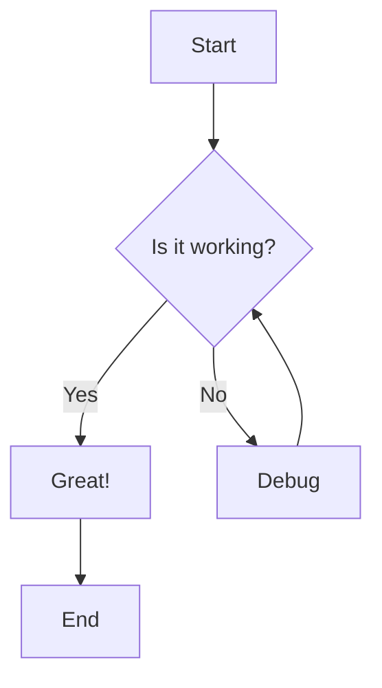

# Markdown Example Document

This is a comprehensive Markdown file demonstrating various syntax elements for testing the noconfetti theme.

## Introduction

Markdown is a lightweight markup language with plain text formatting syntax. It's designed to be easy to read and write, and it can be converted to HTML and other formats.

### Key Features

- Simple and intuitive syntax
- Widely supported across platforms
- Great for documentation
- Easy version control

## Text Formatting

Regular paragraph text with **bold text**, *italic text*, and ***bold italic text***.

You can also use underscores for _italic_ and __bold__ text.

~~Strikethrough text~~ is useful for showing deletions.

Inline `code` can be added with backticks.

## Lists

### Unordered Lists

- First item
- Second item
  - Nested item 1
  - Nested item 2
    - Deeply nested item
- Third item

### Ordered Lists

1. First step
2. Second step
   1. Sub-step A
   2. Sub-step B
3. Third step

### Task Lists

- [x] Complete the documentation
- [x] Review the code
- [ ] Deploy to production
- [ ] Send notification emails

## Links and Images

Here's a [link to GitHub](https://github.com) and here's an [internal link](#code-blocks).


Reference-style links are also supported: [link reference][1]

[1]: https://example.com "Reference link title"

## Code Blocks

### Inline Code

Use the `map()` function to transform arrays in JavaScript.

### Fenced Code Blocks

```javascript
// JavaScript example
function greet(name) {
    return `Hello, ${name}!`;
}

const message = greet('World');
console.log(message);
```

```python
# Python example
def calculate_average(numbers):
    """Calculate the average of a list of numbers."""
    if not numbers:
        return 0
    return sum(numbers) / len(numbers)

result = calculate_average([1, 2, 3, 4, 5])
print(f"Average: {result}")
```

```rust
// Rust example
fn fibonacci(n: u32) -> u32 {
    match n {
        0 => 0,
        1 => 1,
        _ => fibonacci(n - 1) + fibonacci(n - 2),
    }
}

fn main() {
    let result = fibonacci(10);
    println!("Fibonacci(10) = {}", result);
}
```

## Blockquotes

> This is a blockquote.
> It can span multiple lines.
>
> > Nested blockquotes are also possible.
> > They use multiple `>` characters.

> **Note:** Blockquotes can contain other Markdown elements.
>
> - Including lists
> - And other formatting

## Tables

| Feature        | Supported | Priority |
|----------------|-----------|----------|
| Tables         | Yes       | High     |
| Syntax Highlight | Yes     | High     |
| Emoji          | Yes       | Low      |
| LaTeX          | Partial   | Medium   |

Alignment can be controlled:

| Left Aligned | Center Aligned | Right Aligned |
|:-------------|:--------------:|--------------:|
| Left         | Center         | Right         |
| Text         | Text           | Text          |
| 123          | 456            | 789           |

## Horizontal Rules

You can create horizontal rules with three or more:

---

Hyphens, asterisks, or underscores:

***

___

## Escaping Characters

You can escape special characters with backslash: \*not italic\*, \[not a link\]

## HTML in Markdown

You can also use raw HTML in Markdown:

<div style="background-color: #f0f0f0; padding: 10px; border-radius: 5px;">
    <h4>HTML Block</h4>
    <p>This is a paragraph with <strong>bold</strong> and <em>italic</em> text.</p>
</div>

## Advanced Features

### Footnotes

Here's a sentence with a footnote[^1].

And another with a longer footnote[^longnote].

[^1]: This is a simple footnote.

[^longnote]: This is a longer footnote with multiple paragraphs.

    You can include code blocks and other formatting here.

    ```python
    print("Hello from a footnote!")
    ```

### Definition Lists

Term 1
: Definition 1a
: Definition 1b

Term 2
: Definition 2

### Abbreviations

The HTML specification is maintained by the W3C.

*[HTML]: Hyper Text Markup Language
*[W3C]: World Wide Web Consortium

## Mathematical Notation

Inline math: $E = mc^2$

Display math:

$$
\frac{-b \pm \sqrt{b^2 - 4ac}}{2a}
$$

## Diagrams (Mermaid)



## Emoji

You can use emoji in Markdown! :smile: :heart: :rocket:

Some common ones:
- :white_check_mark: Checkmark
- :x: Cross
- :warning: Warning
- :bulb: Idea
- :book: Documentation

## Comments

<!-- This is a comment and won't be rendered -->

<!--
Multi-line comments
are also supported
and useful for notes
-->

## Nested Elements

1. First ordered item

   This is a paragraph under the first item.

   ```javascript
   const code = "inside a list";
   ```

   - Unordered sub-item
   - Another sub-item

2. Second ordered item

   > A blockquote inside a list

   | Column 1 | Column 2 |
   |----------|----------|
   | Data 1   | Data 2   |

## References and Citations

According to the documentation[^doc], this is the recommended approach.

As mentioned in [the official guide](https://example.com/guide), best practices include:

1. Clear documentation
2. Comprehensive testing
3. Regular updates

[^doc]: Official Documentation, Version 2.0, 2024

## Conclusion

This document demonstrates the various Markdown syntax elements that should be properly highlighted in the noconfetti theme. It includes:

- **Text formatting** (bold, italic, strikethrough)
- **Code blocks** (inline and fenced)
- **Lists** (ordered, unordered, task lists)
- **Links and images**
- **Tables**
- **Blockquotes**
- **And much more!**

---

*Last updated: 2024*

**License:** MIT
